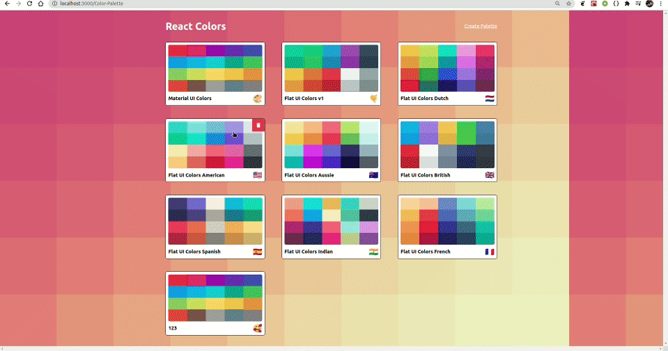

# Color-Palette

  


# Features!

  - Choose your Palette from the List
  - Different Shades of Single Color
  - Responsive
  - Click to Copy
  - Get RGBA,RGB and HEX values of Colors
  - Build Your Own Palette
  - Drag and drop while creating
  - Different Sharpness of Colors



### Tech

Color-Palette uses a number of llibraries to work properly:
* [React] 
* [Material-UI] - Nav-bar and stuff
* [chroma.js] -  Gettting diff shades
* [emoji-mart] - Getting emoji while naming a Palette
* [react-sortable-hoc] - for Drag and Drop
* [react-copy-to-clipboard] - Click to Copy Event

### Installation

Install the dependencies and devDependencies and start the server.

```sh
$ cd color-palette
$ npm install -d
$ npm start
```


